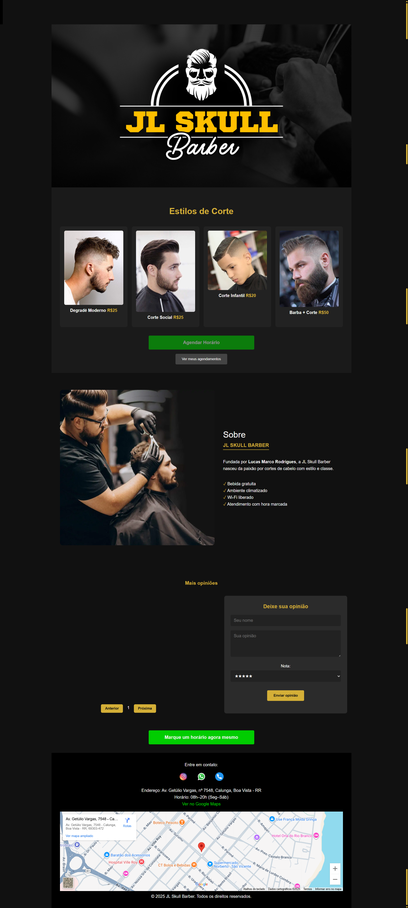

<h1 align="center">💈 JL Skull Barber - Website Oficial 💈</h1>

<div align="center">
  
</div>

<h2 align="center"><a href="https://jsskullbarber.netlify.app/" >Ver Site Online</a></h2>

## Sumário

- <a href="#status-do-projeto">Status do Projeto</a>
- <a href="#funcionalidades-do-projeto">Funcionalidades do Projeto</a>
- <a href="#como-rodar">Como Rodar o Projeto Localmente</a>
- <a href="#tecnologias-utilizadas">Tecnologias Utilizadas</a>
- <a href="#pessoas-autoras">Desenvolvedor</a>

<h2 id="status-do-projeto">Status do Projeto</h2>

🚧 **Em Construção** 🚧

Este projeto está atualmente em desenvolvimento, com funcionalidades essenciais já implementadas e outras em aprimoramento.

<h2 id="funcionalidades-do-projeto">Funcionalidades</h2>

Este website, desenvolvido como um projeto freelancer, visa oferecer uma plataforma moderna e funcional para a barbearia **JL Skull Barber**. As funcionalidades principais incluem:

- ✅ **Sistema de Agendamento Online:** Permite que os clientes agendem seus horários diretamente pelo site. 🗓️
- ✅ **Exibição de Serviços:** Detalhes sobre os cortes e serviços oferecidos. 💇‍♂️
- ✅ **Informações de Contato e Localização:** Endereço, horário de funcionamento e formas de contato. 📍📞
- ✅ **Layout Responsivo:** Adaptação para diferentes dispositivos (desktop, tablet, celular). 📱💻
- ✅ **Feedback/Avaliações (Potencial):** Espaço para clientes deixarem suas opiniões. ⭐
- ✅ **Galeria de Fotos (Potencial):** Fotos dos trabalhos realizados e do ambiente da barbearia. 📸

<br>

<h2 id="como-rodar">Como Rodar o Projeto Localmente</h2>

Para configurar e rodar o projeto em seu ambiente de desenvolvimento local:

1.  **Clone este repositório:**
    ```bash
    $ git clone https://github.com/SEU_USUARIO/SEU_REPOSITORIO.git
    $ cd SEU_REPOSITORIO
    ```
    (Substitua `SEU_USUARIO/SEU_REPOSITORIO.git` pelo link real do repositório da barbearia no GitHub, se ele for público ou estiver sendo versionado).

2.  **Configuração do Firebase:**
    *   Este projeto utiliza o Firebase para o backend (especialmente para o sistema de agendamentos). Você precisará criar um projeto no [Firebase Console](https://console.firebase.google.com/).
    *   Adicione um novo aplicativo web (`</>`) ao seu projeto Firebase e copie as credenciais de configuração (o objeto `firebaseConfig`).
    *   Insira essas credenciais em um arquivo JavaScript no seu projeto (ex: `firebase-config.js` ou diretamente no script principal) onde o Firebase é inicializado. **Para projetos reais, evite expor diretamente as chaves de API em repositórios públicos; use variáveis de ambiente ou ferramentas de build.**
    *   Habilite os serviços do Firebase necessários (Firestore Database, Authentication, etc.) no console, conforme a arquitetura do seu sistema de agendamento.

3.  **Executando o Projeto:**
    Como o projeto usa JavaScript puro (Vanilla JS), você pode simplesmente abrir o arquivo `index.html` no seu navegador. Para evitar problemas de CORS ou para um desenvolvimento mais robusto, é recomendado usar um servidor local:
    *   Se você tem o Node.js instalado, pode usar `http-server`:
        ```bash
        npm install -g http-server
        http-server .
        ```
    *   Ou use a extensão "Live Server" do VS Code.
<h2 id="tecnologias-utilizadas">Tecnologias Utilizadas</h2>

Este projeto foi desenvolvido utilizando as seguintes tecnologias:

1.  [HTML5](https://developer.mozilla.org/pt-BR/docs/Web/HTML) - Para a estruturação semântica do conteúdo.
2.  [CSS3](https://developer.mozilla.org/pt-BR/docs/Web/CSS) - Para estilização, layout e responsividade do site.
3.  [JavaScript (Puro)](https://developer.mozilla.org/pt-BR/docs/Web/JavaScript) - Para a lógica interativa, manipulação do DOM e comunicação.
4.  [Firebase](https://firebase.google.com/) - Backend as a Service (BaaS) para agendamentos e armazenamento de dados.
5.  [Netlify](https://www.netlify.com/) - Para o deploy contínuo e hospedagem do site.
<h2 id="pessoas-autoras">Authors</h2> 

welder barroso
