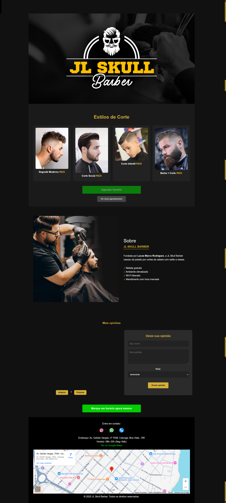

[PT-BR] · [EN](#english-version)

<div align="center">

# JL Skull Barber

> Site oficial de barbearia com sistema de agendamento online, integrado ao Firebase — desenvolvido como projeto freelance real.


[](https://jsskullbarber.netlify.app/)

<br/>



</div>

---

## 📋 Índice

- [Sobre o Projeto](#sobre-o-projeto)
- [Tecnologias](#tecnologias)
- [Como Rodar](#como-rodar)
- [Screenshots](#screenshots)
- [Status](#status)
- [Aprendizados](#aprendizados)
- [Contato](#contato)

---

## Sobre o Projeto

O **JL Skull Barber** é o site oficial de uma barbearia real, desenvolvido como **projeto freelance**. O objetivo foi entregar uma presença digital moderna e funcional para o negócio, com foco direto na conversão: clientes visitam o site e já conseguem agendar um horário, visualizar os serviços disponíveis e entrar em contato, tudo em um único lugar.

O grande diferencial técnico é o **sistema de agendamento online integrado ao Firebase Firestore**, eliminando a necessidade de terceiros para gestão de horários. O proprietário acessa um painel de administração dedicado para visualizar e gerenciar todos os agendamentos recebidos.

> Este projeto é um exemplo direto de como tecnologia bem aplicada resolve problemas reais de negócio — da identidade visual ao backend.

### Funcionalidades

- [x] Sistema de agendamento online com integração Firebase Firestore
- [x] Painel administrativo para gestão de agendamentos
- [x] Exibição de serviços e tabela de preços
- [x] Informações de contato, localização e horário de funcionamento
- [x] Layout responsivo (mobile, tablet e desktop)
- [ ] Galeria de fotos dos trabalhos realizados
- [ ] Sistema de avaliações/reviews dos clientes

---

## Tecnologias


> **Stack intencional:** Vanilla JS + Firebase permite performance máxima, sem overhead de frameworks, ideal para landing pages de negócios locais.

---

## Como Rodar

### Pré-requisitos

```bash
# Nenhuma dependência de Node necessária para o frontend.
# Apenas um navegador moderno ou servidor local.
```

### Instalação

```bash
# 1. Clone o repositório
git clone https://github.com/WelderBM/jl_skull_barber_site.git

# 2. Acesse a pasta
cd jl_skull_barber_site
```

### Executando

**Opção 1 — Abrir diretamente:**
Abra o arquivo `index.html` no seu navegador.

**Opção 2 — Live Server (recomendado):**
Instale a extensão **Live Server** no VS Code e clique em "Open with Live Server" no `index.html`.

**Opção 3 — http-server:**
```bash
npm install -g http-server
http-server .
```
Acesse `http://localhost:8080`.

### Variáveis de ambiente do Firebase

```bash
# Configure suas credenciais Firebase diretamente no script.js
# em uma versão de produção real, use variáveis de ambiente
```

```js
// Substitua no script.js com suas credenciais do Firebase Console
const firebaseConfig = {
  apiKey: "SUA_API_KEY",
  authDomain: "SEU_PROJETO.firebaseapp.com",
  projectId: "SEU_PROJETO",
  // ...
};
```

---

## Status

```
🟡 Em desenvolvimento
```

**Versão atual:** 1.0.0

### Próximos passos

- [ ] Galeria de fotos com upload via Firebase Storage
- [ ] Sistema de avaliações/reviews dos clientes
- [ ] Notificação automática por WhatsApp ao confirmar agendamento
- [ ] Dashboard analytics para o proprietário

---

## Aprendizados

### Contexto

> Projeto freelance real para a barbearia **JL Skull Barber**, com entrega de um produto funcional e em produção para um cliente real.

### O que aprendi

- Integração de **Firebase Firestore** em Vanilla JS sem frameworks — leitura, escrita e escuta de dados em tempo real
- Construção de um **sistema de agendamento** do zero: validação de horários, prevenção de conflitos e fluxo de confirmação
- Gestão de um **painel administrativo** separado do front público, com controle de acesso
- Desenvolvimento de produto com **cliente real**: entender necessidades de negócio e traduzi-las em código
- Deploy e gerenciamento de projeto no **Netlify** com integração contínua

### O que faria diferente

- Adotaria **Next.js** para melhor SEO e Server-Side Rendering
- Implementaria **autenticação Firebase** no painel admin desde o início
- Centralizaria variáveis de ambiente com um arquivo `.env` desde a primeira versão

---

## Contato

<div align="center">

Desenvolvido por **Welder Barroso de Melo**

[](https://nevalo.dev)

[](https://linkedin.com/in/welder-barroso-37b654207)
[](https://github.com/WelderBM)
[](https://wa.me/5595984006377)
[](mailto:welderbarroso.dev@gmail.com)

</div>

---

<div align="center">
<sub>Feito com foco e café · <a href="https://nevalo.dev">nevalo.dev</a></sub>
</div>

---
---

<!-- ════════════════════════════════════════════
     ENGLISH VERSION
════════════════════════════════════════════ -->

<a name="english-version"></a>

[EN] · [PT-BR](#top)

<div align="center">

# JL Skull Barber

> Official barbershop website with an online booking system integrated with Firebase — built as a real freelance project.


[](https://jsskullbarber.netlify.app/)

</div>

---

## 📋 Table of Contents

- [About](#about)
- [Tech Stack](#tech-stack)
- [Getting Started](#getting-started)
- [Status](#status-en)
- [Learnings](#learnings)
- [Contact](#contact-en)

---

## About

**JL Skull Barber** is the official website of a real barbershop, built as a **freelance project**. The goal was to deliver a modern, functional digital presence for the business, with a direct focus on conversion: customers visit the site and can immediately book an appointment, view services, and get in touch — all in one place.

The key technical differentiator is the **online booking system integrated with Firebase Firestore**, eliminating the need for third-party scheduling tools. The owner accesses a dedicated admin panel to view and manage all received appointments.

> This project is a direct example of how well-applied technology solves real business problems — from visual identity to backend.

### Features

- [x] Online booking system with Firebase Firestore integration
- [x] Admin panel for appointment management
- [x] Service showcase and pricing table
- [x] Contact info, location, and opening hours
- [x] Responsive layout (mobile, tablet & desktop)
- [ ] Photo gallery of completed work
- [ ] Customer review/rating system

---

## Tech Stack


> **Intentional stack:** Vanilla JS + Firebase delivers maximum performance with no framework overhead — ideal for local business landing pages.

---

## Getting Started

### Prerequisites

```bash
# No Node.js dependencies required for the frontend.
# Just a modern browser or a local server.
```

### Installation

```bash
# 1. Clone the repo
git clone https://github.com/WelderBM/jl_skull_barber_site.git

# 2. Enter the folder
cd jl_skull_barber_site
```

Open `index.html` in your browser, or use Live Server / http-server for a proper dev experience.

---

<a name="status-en"></a>

## Status

```
🟡 In development
```

---

## Learnings

### Context

> Real freelance project for the **JL Skull Barber** barbershop — delivering a functional, live product to an actual client.

### What I learned

- Integrating **Firebase Firestore** with Vanilla JS — real-time reads, writes, and listeners without a framework
- Building a **booking system** from scratch: time slot validation, conflict prevention, and confirmation flow
- Managing a **separate admin panel** for the owner with access control
- Working with a **real client**: translating business needs into code
- Deploying and managing the project on **Netlify** with continuous integration

### What I'd do differently

- Use **Next.js** for better SEO and Server-Side Rendering
- Implement **Firebase Authentication** on the admin panel from day one
- Use a `.env` file for environment variables from the first version

---

<a name="contact-en"></a>

## Contact

<div align="center">

Built by **Welder Barroso de Melo**

[](https://nevalo.dev)

[](https://linkedin.com/in/welder-barroso-37b654207)
[](https://github.com/WelderBM)
[](https://wa.me/5595984006377)
[](mailto:welderbarroso.dev@gmail.com)

</div>

---

<div align="center">
<sub>Built with focus and coffee · <a href="https://nevalo.dev">nevalo.dev</a></sub>
</div>
